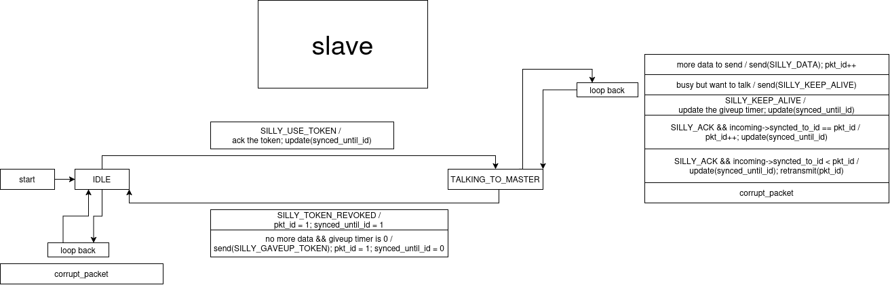
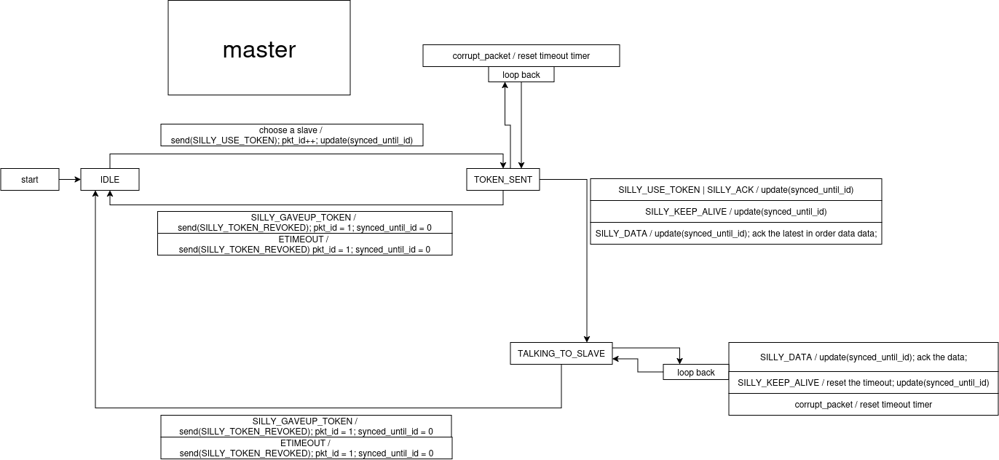

This is a L2 token passing protocol I designed and implemented as part of my embedded systems internship. This protocol was later redesigned in [v2](https://github.com/AliGhaffarian/silly-proto-v2).

# Overview of the protocol
Silly proto v1 enables different nodes of a rs-485 full duplex network (single master, multi slave), to reliably talk. The network can be simulated using the [custom runner](<src/runner.py>) I made that proxies messages between the QEMU virtual machines according to the following diagram:


Packet layout of the protocol:

```
 0                   8                      16                      24                       31
+--+--+--+--+--+--+--+--+--+--+--+--+--+--+--+--+--+--+--+--+--+--+--+--+--+--+--+--+--+--+--+
|                  magic                     |                      len                      |
+--+--+--+--+--+--+--+--+--+--+--+--+--+--+--+--+--+--+--+--+--+--+--+--+--+--+--+--+--+--+--+
|               len (cont.)                  |                     flags                     |
+--+--+--+--+--+--+--+--+--+--+--+--+--+--+--+--+--+--+--+--+--+--+--+--+--+--+--+--+--+--+--+
|              flags (cont.)                 |                 header checksum               |
+--+--+--+--+--+--+--+--+--+--+--+--+--+--+--+--+--+--+--+--+--+--+--+--+--+--+--+--+--+--+--+
|         header checksum (cont.)            |                  data checksum                |
+--+--+--+--+--+--+--+--+--+--+--+--+--+--+--+--+--+--+--+--+--+--+--+--+--+--+--+--+--+--+--+
|           data checksum (cont.)            |                synced until id                |
+--+--+--+--+--+--+--+--+--+--+--+--+--+--+--+--+--+--+--+--+--+--+--+--+--+--+--+--+--+--+--+
|                packet id                   | destination slave id  |
+--------------------------------------------+-----------------------+
```

Explanation of the fields:
- `magic`: A magic number to enable scanning for start of the packet and synchronization
- `len`: Length of the header + data
- `flags`: Control flags, defined in [silly_proto.h](<src/components/silly_proto/include/silly_proto.h>)
- `synced until id` and `packet id` are essentially tcp's seq/ack fields.
    - The window is limited to one packet, because I never implemented (a ring buffer of) packet history for the nodes for them to be able to retransmit older packets. Nodes only maintain their previously sent packet.
- destination slave id: used by master to indicate the destination of the packet
    - Is given to the slave on build time, using [nvs](https://docs.espressif.com/projects/esp-idf/en/stable/esp32/api-reference/storage/nvs_flash.html)
    - According to the topology, slaves aren't able to talk to each other, so there is no node id field that is used by the slaves
    - According to the rs-485 standard, only 32 nodes are supported in the topology, so 8 bits of node id is sufficient

# Protocol Diagrams

**Slave**


**Master**


# Video Demo

[logs produced in the demo](<assets/demo/logs>)  


# Notes on Building

I used clang on this project, to enable clang you need to do the following before building:
```sh
export IDF_TOOLCHAIN=clang
export PATH=\"/home/work/.espressif/tools/esp-clang/esp-20.1.1_20250829/esp-clang/bin:$PATH\" # your path is almost certainly different
```

# Version of Used Software
- ESP-IDF: v6.0.2
